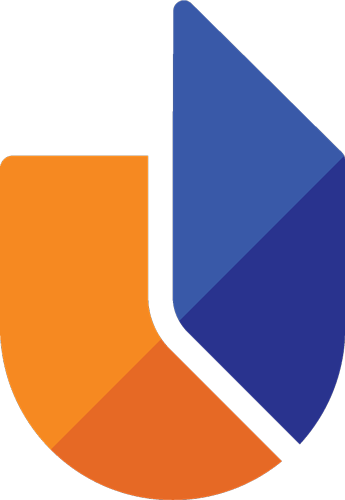

<div align="center">

# 🧭 UTAS GenAI Policy Navigator
### مُرشد سياسة الذكاء الاصطناعي التوليدي — جامعة التقنية والعلوم التطبيقية، نزوى



**An interactive bilingual web app that turns 29 expert-consensus policy recommendations into everyday, usable guidance.**

**تطبيق ويب تفاعلي ثنائي اللغة يحوّل ٢٩ توصية توافقية للخبراء إلى إرشاد عملي يفهمه الجميع.**

[العربية](#-بالعربية) · [English](#-in-english)

</div>

---

# 🇴🇲 بالعربية

## ما هذا المشروع؟

كثيرٌ من سياسات الذكاء الاصطناعي تبقى مجرد وثيقة طويلة لا يقرؤها أحد. هذا المشروع يحلّ المشكلة: يأخذ **٢٩ توصية** خرجت بها **دراسة دلفاي (٢٠٢٦)** حول النزاهة الأكاديمية في جامعة التقنية والعلوم التطبيقية بنزوى، ويحوّلها إلى **أداة حيّة وسهلة** يستخدمها الطالب وعضو هيئة التدريس في دقيقة واحدة.

> الفكرة ببساطة: **بدل أن تسأل «هل يسمح لي باستخدام الذكاء الاصطناعي؟» وتبحث في وثيقة من ٤٠ صفحة — اضغط ثلاث مرات واحصل على الجواب المخصّص لحالتك.**

---

## 🧩 الخصائص (شرح مبسّط)

### 🛡️ ٠) بوابة الطالب + كاشف الذكاء الاصطناعي (النظام الكامل) — **جديد**
نظام متكامل من أربع خطوات:
1. **التسجيل** — يُنشئ الطالب حساباً (اسم، رقم جامعي، بريد، كلمة مرور). تُحفظ الحسابات في **قاعدة بيانات محلية** داخل المتصفح.
2. **التحقّق بالبريد** — يصل رمز مكوّن من ٦ أرقام. *(الوضع الحالي تجريبي: يظهر الرمز داخل النظام في «صندوق وارد تجريبي»، والبنية **جاهزة لربط بريد حقيقي** لاحقاً عبر خادم.)*
3. **رفع الملف** — يرفع الطالب ملف **PDF** (أو يلصق النص).
4. **التقرير** — يفحص **كاشف ذكاء اصطناعي مزدوج** الملف:
   - **ذكاء اصطناعي حقيقي** يحلّل النص مقابل السياسات الـ٢٩،
   - **مؤشرات تحليلية** (تذبذب الجمل، العبارات الشائعة، تنوّع المفردات).
   - النتيجة: **نسبة اشتباه (٠–١٠٠٪)** + **حكم** (ملتزم / مخالف / يحتاج إعلان) + **البنود المخالفة** (مثل S2، S16) + **إبراز الجمل المشتبه بها** + **توصيات** + **شهادة/تقرير قابل للطباعة**.
> الفائدة: يربط السياسة بالممارسة الواقعية، ويعطي الطالب والكلية أداة كشف فعلية تغيّر طريقة التعامل مع النزاهة.

### 🧭 ١) «هل أستطيع استخدامه؟» — شجرة القرار
أداة سؤال وجواب من **ثلاث خطوات**:
1. **من أنت؟** (طالب / عضو هيئة تدريس / باحث / إداري)
2. **بمَ تعمل؟** (واجب مُقيَّم، رسالة علمية، بحث، تصحيح أعمال…)
3. **كيف تستخدم الذكاء الاصطناعي؟** (عصف ذهني، صياغة، تحرير، ترجمة، تحليل…)

ثم يعطيك **حُكماً واضحاً وملوّناً**: مسموح / مسموح بشروط / توخَّ الحذر — مع **قائمة بما عليك فعله بالضبط**، وأرقام بنود السياسة التي يستند إليها الحكم (مثل `S2` و`S16`).
> الفائدة: يلغي الحيرة والاجتهاد الشخصي، ويوحّد الفهم بين الجميع.

### 📄 ٢) مولّد الإعلان
تملأ بياناتك (الاسم، نوع العمل، الأداة المستخدمة، نسبة المساهمة) فيُنشئ لك **إقرار استخدام الذكاء الاصطناعي جاهزاً** بالعربية والإنجليزية معاً، يمكنك:
- **نسخه** بضغطة واحدة، أو
- **طباعته / حفظه PDF** لإرفاقه بعملك.
> الفائدة: يحقّق متطلب الإفصاح (البندان S4 وS5) بشكل موحّد ورسمي خلال ثوانٍ.

### 📊 ٣) مدقّق الامتثال
لوحة لمتابعة تطبيق **كل البنود الـ٢٩**. لكل بند ثلاث حالات: *لم يبدأ / قيد التنفيذ / مُطبَّق*. تضغط على البند فتتغيّر حالته، و:
- **حلقة تقدّم متحرّكة** تُظهر نسبة الامتثال للبنود الإلزامية،
- **حفظ تلقائي** — تبقى حالتك حتى لو أغلقت المتصفح وعدت لاحقاً،
- تصفية حسب المجال أو مستوى الأولوية.
> الفائدة: يحوّل النزاهة إلى رقم قابل للقياس والمتابعة على مستوى القسم.

### 📚 ٤) مكتبة السياسات
مرجع كامل لكل البنود الـ٢٩ **بلغة واضحة** (لا لغة قانونية معقّدة)، مع:
- **بحث فوري**،
- **تصفية** حسب المجال (٦ مجالات) والمستوى (٣ مستويات)،
- **مثال تطبيقي** لكل بند يوضّحه عملياً.
> الفائدة: يفهم أي شخص ما تعنيه كل سياسة وكيف يطبّقها.

---

## 🌟 مزايا إضافية
- 🌍 **ثنائي اللغة بالكامل**: زر واحد يبدّل بين العربية (يمين← يسار) والإنجليزية.
- 🎨 **هوية UTAS الرسمية**: كل الألوان مأخوذة من شعار الجامعة مباشرةً.
- 💾 **يحفظ تقدّمك ولغتك** تلقائياً في المتصفح.
- 📦 **ملف واحد مستقل** يعمل بلا إنترنت — مناسب للعرض على اللجنة.

---

## ▶️ كيف تشغّله؟
**الأسهل:** افتح ملف `UTAS-Policy-Navigator.html` في أي متصفح — كل شيء بداخله ويعمل فوراً بلا إنترنت.

**أو من الكود المصدري** (يحتاج تشغيله عبر خادم محلي):
```bash
python3 -m http.server 8000
# ثم افتح http://localhost:8000
```

---
---

# 🌐 In English

## What is this?

Most AI policies end up as a long document nobody reads. This project fixes that: it takes the **29 recommendations** produced by the **2026 Delphi study** on academic integrity at UTAS Nizwa and turns them into a **living, easy-to-use tool** that a student or faculty member can use in under a minute.

> In short: **Instead of asking "Am I allowed to use AI?" and digging through a 40-page document — click three times and get an answer tailored to your exact situation.**

---

## 🧩 The features (plain explanation)

### 🛡️ 0) Student Portal + AI Detector (the full system) — **NEW**
A complete four-step system:
1. **Register** — a student creates an account (name, ID, email, password). Accounts are stored in a **local database** in the browser.
2. **Email verification** — a 6-digit code is issued. *(Currently in demo mode: the code appears inside the app's "demo inbox"; the architecture is **ready to wire to real email** later via a backend.)*
3. **Upload** — the student uploads a **PDF** (or pastes the text).
4. **Report** — a **dual AI detector** analyses the file:
   - **Real AI** evaluates the text against all 29 policies,
   - **Analytical signals** (sentence burstiness, common phrases, lexical diversity).
   - Output: an **AI-suspicion score (0–100%)** + a **verdict** (compliant / violation / needs declaration) + **violated policies** (e.g. S2, S16) + **highlighted suspicious sentences** + **recommendations** + a **printable certificate/report**.
> Benefit: it links policy to real practice and gives both student and college an actual detection tool that changes how integrity is handled.

### 🧭 1) "Can I use AI?" — Decision Tree
A **three-step** question-and-answer tool:
1. **Who are you?** (student / faculty / researcher / admin)
2. **What are you working on?** (graded assignment, thesis, research, marking…)
3. **How are you using AI?** (brainstorming, drafting, editing, translation, analysis…)

You then get a **clear, colour-coded verdict** — Permitted / Conditionally permitted / Caution — with a **precise to-do list** and the policy IDs the verdict is based on (e.g. `S2`, `S16`).
> Benefit: removes guesswork and gives everyone the same consistent answer.

### 📄 2) Declaration Generator
Fill in your details (name, work type, AI tool, contribution level) and it produces a **ready-to-use AI-use declaration** in Arabic **and** English that you can:
- **Copy** with one click, or
- **Print / Save as PDF** to attach to your work.
> Benefit: meets the disclosure requirement (policies S4 & S5) in a uniform, official way within seconds.

### 📊 3) Compliance Checker
A dashboard to track all **29 policies**. Each has three states: *Not started / In progress / Implemented*. Click to cycle a policy's status, and you get:
- an **animated progress ring** showing mandatory-tier compliance,
- **automatic saving** — your status persists even after closing the browser,
- filtering by domain or priority tier.
> Benefit: turns integrity into a measurable, trackable number per department.

### 📚 4) Policy Library
A complete reference to all 29 statements **in plain language** (no dense legalese), with:
- **instant search**,
- **filters** by domain (6) and tier (3),
- a **practical example** for every policy.
> Benefit: anyone can understand what each policy means and how to apply it.

---

## 🌟 Extra highlights
- 🌍 **Fully bilingual**: one tap switches between Arabic (RTL) and English (LTR).
- 🎨 **Official UTAS identity**: every colour is sampled directly from the university logo.
- 💾 **Saves your progress & language** automatically in the browser.
- 📦 **Single standalone file** that works offline — perfect for a committee demo.

---

## ▶️ How to run it
**Easiest:** open `UTAS-Policy-Navigator.html` in any browser — fully self-contained, works offline.

**Or from source** (must be served over HTTP):
```bash
python3 -m http.server 8000
# then open http://localhost:8000
```

---

## 📁 Project structure · بنية المشروع

```
.
├── index.html                    # App entry · نقطة الدخول
├── UTAS-Policy-Navigator.html    # ⭐ Standalone build · النسخة المستقلة
├── assets/utas-logo.png          # UTAS brand mark · شعار الجامعة
└── js/
    ├── data.js              # Palette · 29 policies · logic · i18n
    ├── institution-data.js  # Departments · branches · scoring
    ├── auth.js              # Local database · register/verify/login
    ├── detector.js          # Dual AI detector (heuristics + Claude)
    ├── components.jsx       # Icons, badges, animation hooks
    ├── home.jsx             # Animated landing
    ├── command-center.jsx   # Institutional cockpit (heatmap, alerts)
    ├── decision.jsx         # Decision tree — "Can I use AI?"
    ├── declaration.jsx      # Declaration generator (+ QR)
    ├── compliance.jsx       # Compliance checker
    ├── library.jsx          # Policy library
    ├── assistant.jsx        # Policy AI assistant
    ├── portal-auth.jsx      # Student sign-up / login / verify screens
    ├── portal.jsx           # Student dashboard + PDF upload + detect
    ├── report.jsx           # Detection report, highlights, certificate
    ├── guide.jsx            # In-app bilingual guide
    └── app.jsx              # Shell · routing · language · RTL/LTR
```

> **Note on the AI detector & email:** the real-AI analysis and the email step both work best when served online (the AI runs through the built-in assistant; email is in demo mode and ready to wire to a real provider). Offline, the detector automatically falls back to its analytical-signal engine, and text can be pasted if a PDF can't be parsed.

---

## 🎨 Design system · نظام التصميم

| Colour · اللون | Hex | Use · الاستخدام |
|---|---|---|
| Signature Orange · برتقالي | `#FC8424` | Primary accent · لمسة أساسية |
| Burnt Orange · برتقالي محروق | `#E46C24` | Advisory tier · مستوى استشاري |
| Royal Blue · أزرق ملكي | `#3C54A8` | Recommended tier · مستوى موصى به |
| Deep Indigo · كحلي عميق | `#243090` | Mandatory tier · مستوى إلزامي |

**Type · الخطوط:** Newsreader · IBM Plex Sans Arabic · IBM Plex Mono

---

## 📚 About the research · حول الدراسة

Built on expert consensus from a **Delphi study (2026)** on generative-AI academic-integrity policy at UTAS Nizwa. The 29 statements span **six domains** (Transparency, Authorship, Quality Assurance, Data Privacy, AI Literacy, Omani Context) and **three priority tiers** (Mandatory, Recommended, Advisory).

مبني على إجماع الخبراء من **دراسة دلفاي (٢٠٢٦)** حول سياسة نزاهة الذكاء الاصطناعي التوليدي في الجامعة. تتوزّع البنود الـ٢٩ على **ستة مجالات** و**ثلاثة مستويات أولوية**.

- **Research · إعداد:** Sheikha Sulaiman Al-Hinai — M.Ed. Digital Transformation & Innovation
- **Supervisor · إشراف:** Dr Rolando Lontok Jr.

---

<div align="center">

© 2026 · Released for academic & institutional use at UTAS · للاستخدام الأكاديمي والمؤسسي

</div>
